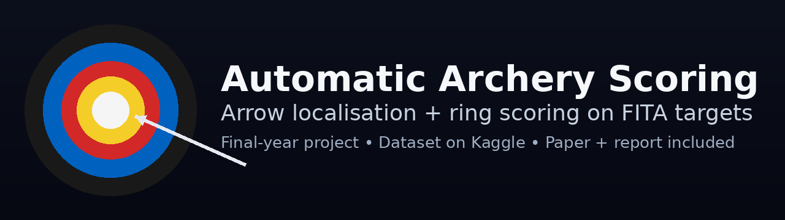
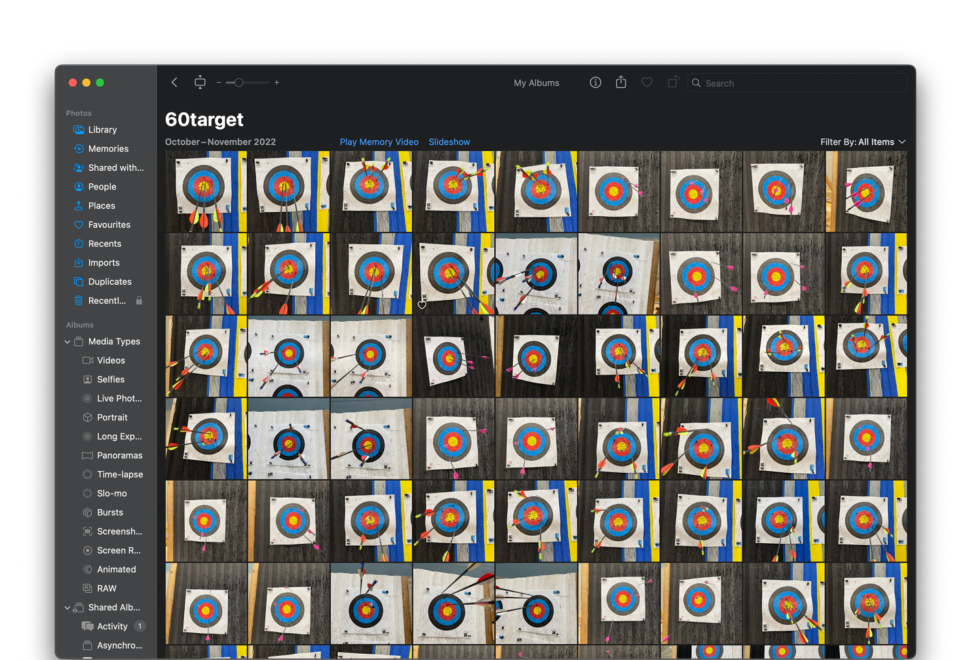
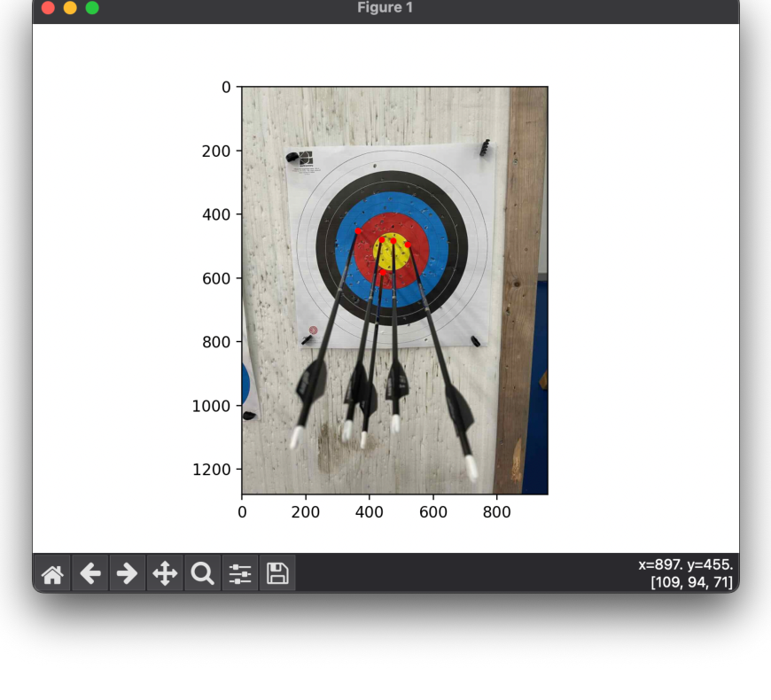
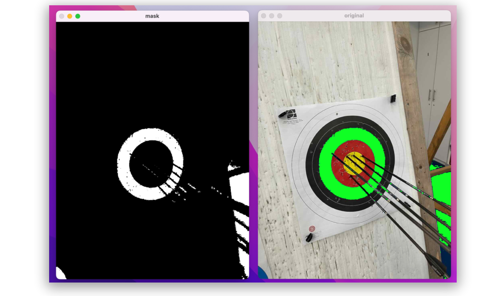
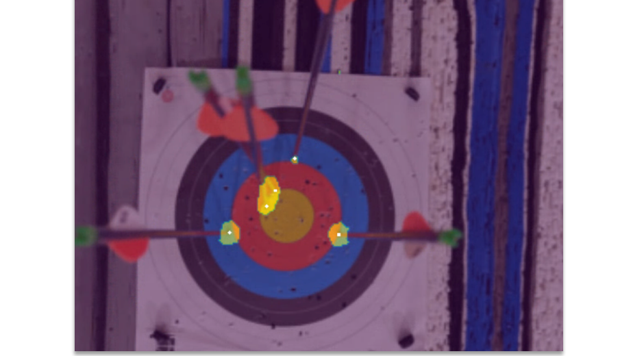
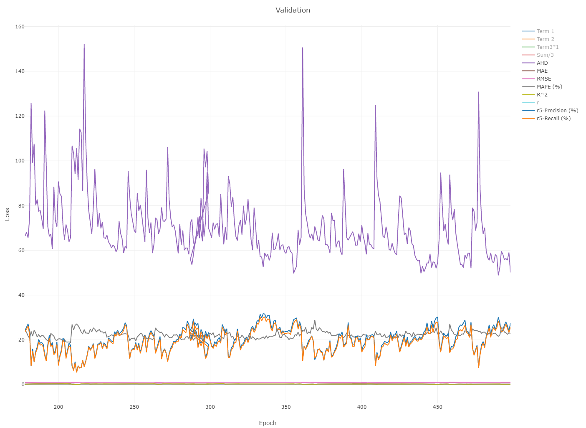

# Automatic Archery Scoring



[](https://www.python.org/downloads/)
[](https://zenodo.org/records/8220337)
[](https://www.kaggle.com/datasets/haozhema/archery-target-fita-60cm)
[](LICENSE)

**Deep learning-based arrow localisation + classical CV ring scoring for FITA 60cm archery targets.**

A final-year project implementing automatic archery scoring using a hybrid approach: modified U-Net for arrow tip detection with Weighted Hausdorff Distance loss, and classical computer vision for ring geometry estimation and score calculation.

---

## 📄 Publications & Resources

- **📝 Paper (IMVIP 2023)**: [Ma-Madden-IMVIP2023.pdf](Ma-Madden-IMVIP2023.pdf) | [Zenodo](https://zenodo.org/records/8220337)
- **📊 Dataset (Kaggle)**: [FITA 60cm Archery Target Dataset](https://www.kaggle.com/datasets/haozhema/archery-target-fita-60cm)
- **📖 Full Report**: [Final Year Project Report-1.pdf](Final%20Year%20Project%20Report-1.pdf)

---

## Table of Contents

- [Overview](#overview)
- [System Architecture](#system-architecture)
- [Key Features](#key-features)
- [Dataset](#dataset)
- [Results](#results)
- [Installation](#installation)
- [Usage](#usage)
- [Project Structure](#project-structure)
- [Technical Details](#technical-details)
- [Challenges & Limitations](#challenges--limitations)
- [Future Work](#future-work)
- [Citation](#citation)
- [Acknowledgments](#acknowledgments)
- [License](#license)

---

## Overview

This system automatically scores archery targets from smartphone/camera photos by:

1. **Detecting arrow tips** using deep learning (modified U-Net trained with Weighted Hausdorff Distance point supervision)
2. **Estimating target ring geometry** using classical CV techniques (color masking, morphological operations, ellipse fitting)
3. **Computing scores** by determining which ring each arrow tip falls within


The hybrid approach combines the robustness of deep learning for arrow detection with the interpretability and reliability of classical computer vision for geometric scoring.

---

## System Architecture

### 1. **Arrow Localisation (Deep Learning)**

- **Model**: Modified U-Net architecture
- **Training**: Point supervision using Weighted Hausdorff Distance (WHD) loss
- **Input**: RGB images of archery targets (various angles, lighting conditions)
- **Output**: Pixel coordinates of arrow tip locations

The WHD loss function enables training with only point annotations (arrow tips) rather than requiring full segmentation masks, significantly reducing annotation effort.

**Reference**: *J. Ribera, D. Guera, Y. Chen and E. Delp, "Locating Objects Without Bounding Boxes," CVPR 2019*

### 2. **Ring Estimation (Classical CV)**

- **Method**: Color-based masking + morphological operations + ellipse fitting (OpenCV)
- **Process**:
  1. Extract target region using color thresholding
  2. Apply morphological closing to clean contours
  3. Detect concentric ring contours
  4. Fit ellipses to estimate ring boundaries
- **Output**: Ring geometry model (center, radii, orientation)

### 3. **Score Calculation**

- Calculate Euclidean distance from each detected arrow tip to ring center
- Map distance to archery score (10, 9, 8, ..., 1, Miss)
- Generate JSON output with scores and overlay visualizations

---

## Key Features

✅ **Point-based supervision** - Train with simple point annotations instead of masks
✅ **Perspective-robust** - Handles off-angle photos using ellipse fitting
✅ **Real-world deployment** - Tested on smartphone photos with torn/damaged targets
✅ **Complete pipeline** - End-to-end from image input to scored output
✅ **Open dataset** - 100+ annotated images published on Kaggle
✅ **Peer-reviewed** - Published at IMVIP 2023 conference

---

## Dataset



The **FITA 60cm Archery Target Dataset** is publicly available on Kaggle and contains:

- **100+ images** of FITA 60cm targets captured under various conditions
- **JSON annotations** with arrow tip point coordinates
- Images include clean targets and targets with tears, wrinkles, and damage
- Various perspectives, lighting conditions, and distances

**Download**: [Kaggle Dataset](https://www.kaggle.com/datasets/haozhema/archery-target-fita-60cm)

### Example Annotations

**Ground-truth arrow tip labels:**


**Masking + contour extraction for ring geometry:**


**Ring model + scoring visualization:**


**Model saliency map (validation):**


---

## Results

### Performance Summary

| Test Set | Precision @ r=5 | Recall @ r=5 | Notes |
|----------|-----------------|--------------|-------|
| **Clean targets** (5 images) | **100%** | **100%** | Perfect detection on pristine paper |
| **Torn/damaged targets** (validation set) | **~40%** | **~40%** | Real-world conditions with paper damage |

**Metrics used**:
- **Precision/Recall @ r=5**: Detections within 5 pixels of ground truth
- **AHD (Average Hausdorff Distance)**: Mean distance between predicted and ground-truth points
- **MAE, RMSE, MAPE**: Score error metrics

> **Note**: The 100% result is on a small clean-paper sample. See paper/report for detailed evaluation and limitations.

### Training Metrics



*Validation loss and metrics during training showing convergence.*

---

## Installation

### Prerequisites

- Python 3.9+
- CUDA 11.0+ (recommended for GPU acceleration)
- OpenCV
- PyTorch

### Setup

```bash
# Clone the repository
git clone https://github.com/ma-haozhe/final-year-project.git
cd final-year-project

# Install dependencies
pip install torch torchvision --index-url https://download.pytorch.org/whl/cu118
pip install opencv-python numpy matplotlib pillow
```

**Note**: This repository does not yet include a `requirements.txt`. The main dependencies are:
- `torch` and `torchvision` (PyTorch for deep learning)
- `opencv-python` (OpenCV for image processing)
- `numpy`, `matplotlib`, `pillow` (standard scientific Python libraries)

### Model Weights

Pre-trained model weights are not currently included in this repository. To train your own model:
1. Download the dataset from Kaggle
2. Configure training parameters
3. Run the training script (see [Usage](#usage))

---

## Usage

### Basic Scoring Pipeline

```bash
# Process a single target image
python scoring.py --image path/to/target.jpg

# Run arrow detection only
python blob_detection.py --image path/to/target.jpg

# Visualize ring estimation
python ring-illustration.py --image path/to/target.jpg
```

### Dataset Preparation

```bash
# Parse JSON annotations from Label Studio format
python json_parser_plus.py --input annotations.json --output parsed/

# Convert annotations to training format
python parse_json_to_obj_locator_train.py

# Visualize ground truth annotations
python plot_ground_truth_from_json.py --json annotations.json
```

### Training

```bash
# Train the arrow detection model
# (Training script configuration may need adjustment based on your setup)
python main.py --mode train --epochs 500 --batch-size 8
```

**Note**: Training configuration and scripts are research-grade and may require customization.

---

## Project Structure

```
final-year-project/
├── scoring.py                          # Main scoring pipeline
├── blob_detection.py                   # Arrow tip detection utilities
├── mask_and_morph_update_func.py       # Ring extraction & ellipse fitting
├── ring-illustration.py                # Ring visualization
│
├── json_parser_plus.py                 # Annotation parsing
├── parse_json_to_obj_locator_train.py  # Convert to training format
├── plot_ground_truth_from_json.py      # Visualization tools
│
├── annotations/                        # Annotation files
├── paper/                              # Paper-related materials
├── 60cm-batch2/                        # Additional dataset images
│
├── Ma-Madden-IMVIP2023.pdf             # Published paper
├── Final Year Project Report-1.pdf     # Full technical report
└── README.md                           # This file
```

**Key Files**:
- `scoring.py` - End-to-end scoring pipeline
- `blob_detection.py` - Arrow detection logic
- `mask_and_morph_update_func.py` - Ring geometry estimation
- `json_parser_plus.py` - Dataset annotation utilities

---

## Technical Details

### Modified U-Net Architecture

The arrow detection model is based on U-Net but modified for point detection:
- **Encoder**: Standard convolutional downsampling path
- **Decoder**: Upsampling path with skip connections
- **Output**: Single-channel probability map (arrow tip locations)

### Weighted Hausdorff Distance Loss

Unlike standard segmentation losses, WHD loss:
- Works directly with point annotations (no need for masks)
- Handles variable numbers of points per image
- Provides gradient signals for all predicted points
- More robust to annotation noise

**Formula**: See paper for mathematical details

### Ring Detection Algorithm

1. **Color-based masking**: Extract target region (blue, red, gold rings)
2. **Morphological closing**: Remove small gaps/tears in paper
3. **Contour detection**: Find ring boundaries using `cv2.findContours`
4. **Ellipse fitting**: Fit ellipses to handle perspective distortion (`cv2.fitEllipse`)
5. **Geometric model**: Build concentric ring model with estimated center/radii

---

## Challenges & Limitations

### Dataset Challenges
- **Manual annotation**: Time-intensive process to label arrow tips
- **Variable conditions**: Targets photographed at different angles, lighting, distances
- **Real-world damage**: Torn paper, wrinkles, shadows affect detection

### Model Challenges
- **Training stability**: WHD loss requires careful hyperparameter tuning
- **Perspective distortion**: Extreme angles remain challenging
- **Generalization**: Performance drops on heavily damaged targets

### Current Limitations
- **Small test set**: Clean-target results based on only 5 images
- **No real-time inference**: Current implementation not optimized for speed
- **Model weights unavailable**: Pre-trained weights not yet published
- **Fixed target type**: Only works with FITA 60cm targets

---

## Future Work

🚀 **Potential improvements**:

- Extend to other target types (40cm, 80cm, compound targets)
- Real-time mobile app deployment (iOS/Android)
- Multi-target detection in single image
- Automatic perspective correction
- Integration with archery scoring apps/platforms
- Active learning for continuous model improvement
- Lightweight model variants for edge devices

---

## Citation

If you use this work in your research, please cite:

```bibtex
@inproceedings{ma_madden_imvip2023,
  title={Automatic Archery Scoring using Deep Learning and Image Processing},
  author={Ma, Haozhe and Madden, Michael},
  booktitle={Irish Machine Vision and Image Processing Conference (IMVIP)},
  year={2023},
  doi={10.5281/zenodo.8220337}
}
```

**Paper**: [https://zenodo.org/records/8220337](https://zenodo.org/records/8220337)

---

## Acknowledgments

- **Supervisor**: Prof. Michael Madden, University of Galway
- **Reference Work**: Ribera et al., "Locating Objects Without Bounding Boxes" (CVPR 2019)
- **Dataset Hosting**: Kaggle
- **Conference**: IMVIP 2023

This project was completed as a final-year undergraduate project at the University of Galway (2023).

---

## License

This project is licensed under the MIT License - see the [LICENSE](LICENSE) file for details.

**Dataset License**: See [Kaggle dataset page](https://www.kaggle.com/datasets/haozhema/archery-target-fita-60cm) for dataset-specific terms.

---

## Contact

**Haozhe Ma**
- GitHub: [@ma-haozhe](https://github.com/ma-haozhe)
- Project Link: [https://github.com/ma-haozhe/final-year-project](https://github.com/ma-haozhe/final-year-project)

For questions about the paper or dataset, please open an issue on GitHub.

---

<div align="center">

**🎯 Made with precision | 🤖 Powered by Deep Learning | 📊 Published at IMVIP 2023**

</div>
